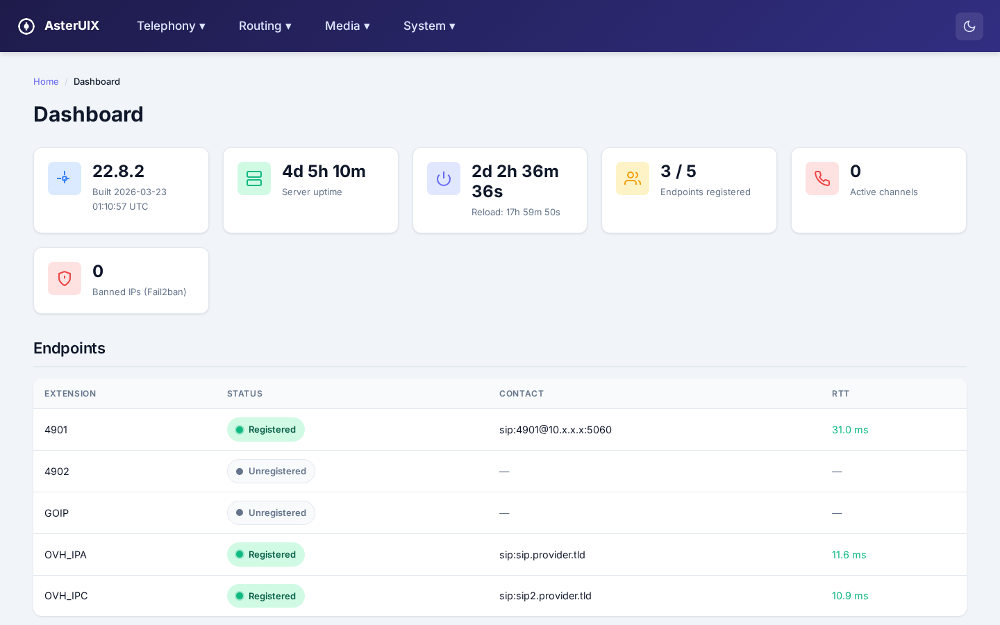
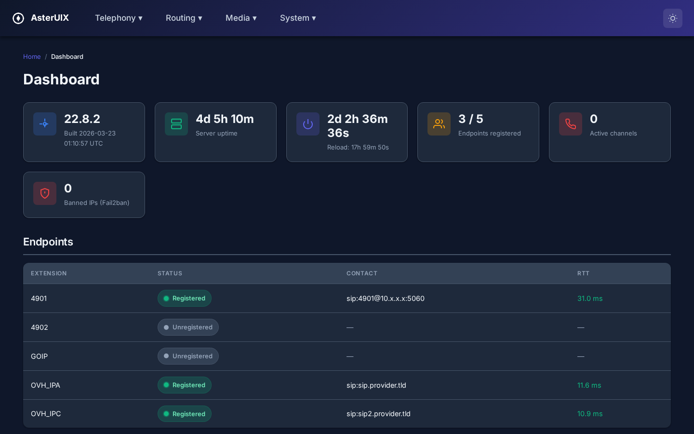

# AsterUIX

A lightweight web interface for managing an Asterisk 22 LTS PBX, built with Flask. No FreePBX/VitalPBX — pure Asterisk with a minimal, purpose-built management layer.

> 🇫🇷 **Built for French telephony** — default language set to `fr`, French G.722 sound files included, Europe/Paris timezone, French indications (dial tones, busy tones, ringing), and spam prefix database pre-loaded with known French spam ranges.

## Screenshots

| Light Theme | Dark Theme |
|:-----------:|:----------:|
|  |  |

## Features

- **Dashboard** — Live system status with auto-refresh (3s polling): Asterisk version, server/service uptime, registered endpoints, active calls, Fail2ban bans
- **Extensions** — CRUD for PJSIP endpoints (4900–4904) with voicemail box sync, per-extension dialplan context
- **Trunks** — Registration, identify-only, and device (registers to us) SIP trunk management
- **Music on Hold** — MoH class/track management with automatic MP3/WAV/OGG → 16kHz WAV conversion
- **Announcements** — Upload and activate closed-hours announcements (auto-converted to G722-compatible WAV)
- **Voicemail** — Per-mailbox message listing, in-browser playback, delete, blast configuration
- **Time Groups** — Business hours rules with day/time selectors and overlap detection
- **Holidays** — Fixed (MMDD) and variable (YYYYMMDD) holiday management via AstDB
- **Spam Blocking** — 4-digit caller ID prefix blacklist via AstDB, single + bulk import, blocked calls log
- **Inbound Routes** — Visual 5-step call flow editor (spam → holidays → time → open/closed routing)
- **Conference Rooms** — ConfBridge room settings (max members, MoH class, announce join/leave)
- **Dialplan Visualization** — Read-only CSS flowchart of the inbound call path with live config values
- **Backup/Restore** — Full system backup including WebUI database, config files, and voicemail; auto-detect backup files during install for one-shot rebuild

## Architecture

- **No GUI database for Asterisk config** — the WebUI generates native Asterisk `.conf` files via `#include` directives, so Asterisk always reads plain config files
- **AstDB as source of truth** for runtime data (spam prefixes, holidays) — changes take effect immediately without reload
- **Atomic config writes** — temp file + rename to avoid partial writes
- **Config snapshots** — automatic snapshots before every config change for easy rollback
- **Audit logging** — dual-write to SQLite + file log for all mutations

## Stack

| Component | Choice |
|-----------|--------|
| Language | Python 3.11 |
| Framework | Flask 3.1.1 |
| Database | SQLite (WAL mode) |
| Auth | bcrypt + session cookies (HttpOnly, SameSite=Strict, 30-min timeout) |
| CSRF | Flask-WTF |
| Frontend | Server-rendered Jinja2 + vanilla CSS/JS |
| Process | Waitress WSGI behind systemd |

## Requirements

- Debian 12 (bookworm)
- Asterisk 22 LTS (compiled from source with PJSIP)
- Python 3.11+
- sox + libsox-fmt-mp3 (for audio conversion)
- Fail2ban (optional, for dashboard display)

## Installation

### Automated (recommended)

The install script handles everything on a fresh Debian 12/13 system: compiles Asterisk 22 LTS, sets up AsterUIX, creates a default extension (4900), and optionally restores from backup.

```bash
git clone https://github.com/lemassykoi/asteruix.git /opt/asterisk-webui
cd /opt/asterisk-webui
sudo ./install/install.sh
```

**Restore from backup during install:**
```bash
# Option 1: explicit flag
sudo ./install/install.sh --restore /path/to/asterisk-backup-YYYYMMDD-HHMMSS.tar.gz

# Option 2: auto-detect — just place the backup file in the repo folder
cp /path/to/asterisk-backup-*.tar.gz /opt/asterisk-webui/
sudo ./install/install.sh
```

Use `-y` to skip confirmation prompts (e.g. `./install/install.sh -y`).

### Backup & Restore

```bash
# Create a backup (config + DB + voicemail)
asterisk-backup.sh

# Restore from a backup
asterisk-restore.sh /var/backups/asterisk/asterisk-backup-YYYYMMDD-HHMMSS.tar.gz
```

Backups are stored in `/var/backups/asterisk/` (last 10 kept). The backup includes the WebUI database, so all settings (trunks, ring groups, IVR menus, outbound routes, conference rooms, UI users) are preserved. On restore, all 11 managed config files are regenerated from the database.

### Manual

```bash
# Clone
git clone https://github.com/lemassykoi/asteruix.git /opt/asterisk-webui
cd /opt/asterisk-webui

# Python environment
python3 -m venv venv
source venv/bin/activate
pip install -r requirements.txt

# Migrate Asterisk config to use #include directives
bash scripts/migrate-includes.sh

# Initialize database & create admin user
python manage.py create-admin -u admin -p <password>

# Import existing Asterisk config into the database
python manage.py import-extensions
python manage.py import-moh
python manage.py import-announcements
python manage.py import-timegroups
python manage.py import-inbound
python manage.py import-conference

# Start
systemctl enable --now asterisk-webui
```

The WebUI listens on `0.0.0.0:8081` (all interfaces) so it can be accessed from the LAN — the Asterisk server typically has no GUI or local browser.

## Project Structure

```
app/
├── __init__.py          # Flask app factory
├── asterisk_cmd.py      # Asterisk CLI adapter (allowlisted commands, typed parsers)
├── audit.py             # Audit logging (SQLite + file)
├── auth.py              # Login/logout, bcrypt, session management
├── db.py                # SQLite schema, migrations
├── generators.py        # Config file generators (PJSIP, dialplan, MoH, ConfBridge)
├── snapshots.py         # Config snapshot/restore
├── extensions.py        # Extensions CRUD + API
├── trunks.py            # Trunks CRUD + API
├── moh.py               # Music on Hold management
├── announcements.py     # Announcements management
├── voicemail.py         # Voicemail operations + blast config
├── timegroups.py        # Time group rules
├── holidays.py          # Fixed/variable holidays (AstDB)
├── spam.py              # Spam prefix blacklist (AstDB)
├── inbound.py           # Inbound route flow editor
├── conference.py        # ConfBridge room settings
├── dialplan.py          # Dialplan visualization
├── backups.py           # Backup/restore integration
├── system.py            # Dashboard + system status API
├── routes.py            # Core routes
├── templates/           # Jinja2 templates
└── static/css/          # Stylesheet
manage.py                # CLI management commands
wsgi.py                  # WSGI entry point
scripts/
├── asterisk-backup.sh   # Full backup (config + DB + voicemail)
├── asterisk-restore.sh  # Restore with config regeneration from DB
├── migrate-includes.sh  # Add #include directives to Asterisk configs
└── rollback-includes.sh # Remove #include directives
tests/
└── test_asterisk_cmd.py # Unit tests for Asterisk adapter
```

## License

Private — not licensed for redistribution.
